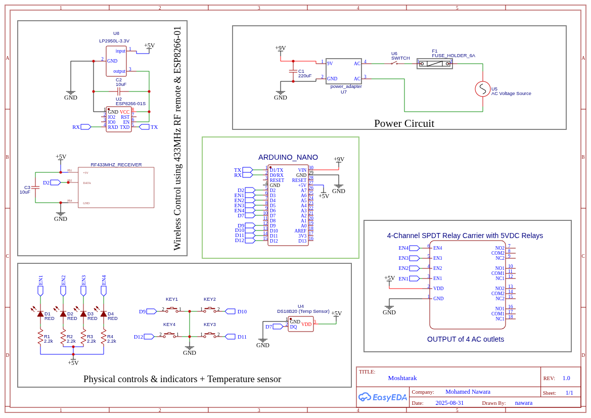

# Moshtarak – Smart Home Controller  

Moshtarak is a DIY smart home project that combines **Arduino Nano**, **ESP8266-01**, and a **4-channel relay module** to control AC outlets with multiple interfaces:  
- Physical buttons & LED indicators  
- 433 MHz RF remote  
- ESPHome integration (via ESP8266) with Home Assistant  
- Temperature monitoring  

---

## 📂 Project Files  

- **`Moshtarak2.ino`** → Arduino Nano firmware.  
  - Handles physical button input, LED indicators, 433 MHz RF signals, temperature sensor (DS18B20), and relay control.  
  - Communicates with ESP8266-01 over UART.  

- **`moshtarak(esp8266-code).yaml`** → ESPHome configuration for ESP8266-01.  
  - Exposes relays and temperature sensor to Home Assistant.  
  - Relays are controlled by sending/receiving UART messages to/from the Arduino.  
  - Provides Wi-Fi, OTA updates, and HA API support.  

- **`Schematic_Moshtarak_2025-08-31.png`** → Circuit schematic (EasyEDA).  
  - Shows wiring of ESP8266-01, Arduino Nano, RF433 MHz receiver, relay module, DS18B20 sensor, LEDs, and buttons.  
  - Includes power circuit with 9 V adapter and regulator for 5 V / 3.3 V rails.  

---

## 🛠 Hardware Components  

- Arduino Nano  
- ESP8266-01 (with AT firmware / ESPHome)  
- 4-Channel Relay Module (5 V, SPDT)  
- RF433 MHz Receiver module  
- DS18B20 digital temperature sensor  
- Push buttons (×4)  
- LEDs with resistors (×4)  
- 9 V adapter, fuse, and power regulation (5 V & 3.3 V)  

---

## 🔌 Features  

- **Relay Control**  
  - Via buttons (active low) with LED feedback.  
  - Via RF remote (433 MHz).  
  - Via Home Assistant (ESPHome).  

- **Temperature Sensor**  
  - DS18B20 connected to Arduino, readings sent over UART.  
  - Exposed as `Arduino Temperature` in Home Assistant.  

- **Home Assistant Integration**  
  - ESPHome manages Wi-Fi & HA connection.  
  - Switches in HA dashboard map directly to relay outputs.  
  - OTA updates supported.  

- **Safety**  
  - Fuse-protected AC input.  
  - Isolated relay module for mains voltage switching.  

---

## 🔧 Setup Instructions  

1. **Hardware Wiring**  
   - Follow schematic `Schematic_Moshtarak_2025-08-31.png`.  
   - Power Arduino with 9 V input, ESP8266 with 3.3 V regulator.  
   - Ensure relay module is powered from 5 V.  

2. **Arduino (Nano)**  
   - Upload `Moshtarak2.ino` via Arduino IDE.  
   - This handles relays, RF, buttons, and UART messages.  

3. **ESP8266 (ESP-01)**  
   - Flash ESPHome with `moshtarak(esp8266-code).yaml`.  
   - Configure `wifi_ssid` and `wifi_password` in your ESPHome secrets.  
   - Add to Home Assistant (via ESPHome integration).  

4. **Home Assistant**  
   - Devices will show up as switches (`LED1`–`LED4`) and one temperature sensor.  
   - Use automations (e.g., turn off outlet when phone battery = 100%).  

---

## 🔄 UART Message Protocol  

The Arduino and ESP8266 communicate via UART (9600 baud).  
Messages are newline-terminated (`\n`).  

### From ESP8266 → Arduino  
- `LED1_ON` → Turn relay 1 ON  
- `LED1_OFF` → Turn relay 1 OFF  
- `LED2_ON` → Turn relay 2 ON  
- `LED2_OFF` → Turn relay 2 OFF  
- `LED3_ON` → Turn relay 3 ON  
- `LED3_OFF` → Turn relay 3 OFF  
- `LED4_ON` → Turn relay 4 ON  
- `LED4_OFF` → Turn relay 4 OFF  

### From Arduino → ESP8266  
- `TEMP:<value>` → Sends temperature reading (°C). Example: `TEMP:27.3`  
- `LED1_ON` / `LED1_OFF` → Report status of relay 1  
- `LED2_ON` / `LED2_OFF` → Report status of relay 2  
- `LED3_ON` / `LED3_OFF` → Report status of relay 3  
- `LED4_ON` / `LED4_OFF` → Report status of relay 4  

This ensures Home Assistant and the Arduino stay in sync.  

---

## 📸 Preview  

  

---

## ⚠️ Disclaimer  

⚡ **Warning:** This project controls **mains AC voltage**.  
- Only attempt if you understand electrical safety.  
- Always isolate low-voltage (Arduino/ESP) side from high-voltage (relay/AC) side.  
- Use a properly rated fuse and enclosure.  
